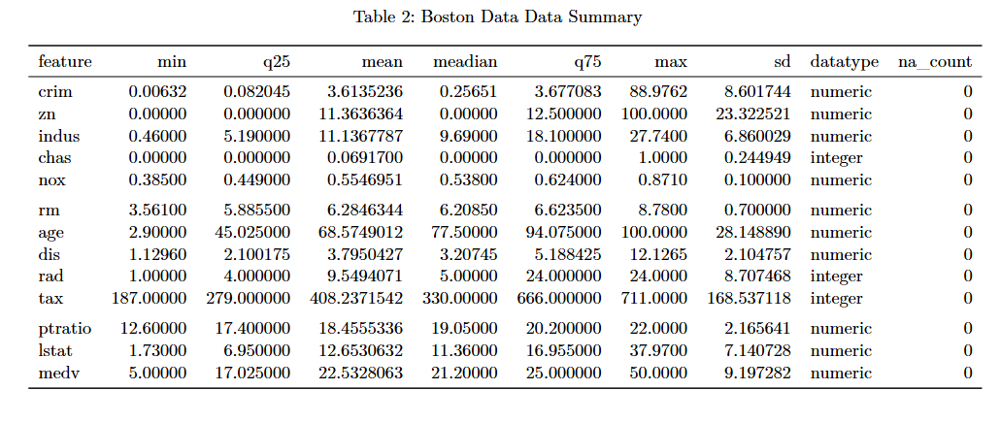
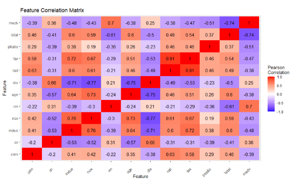
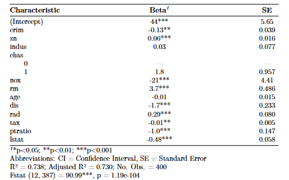
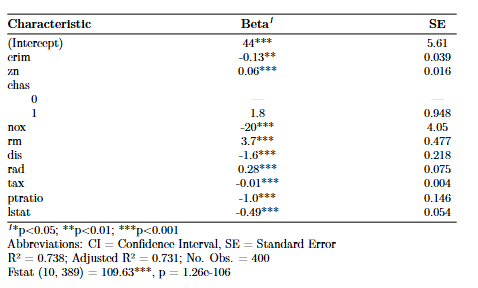
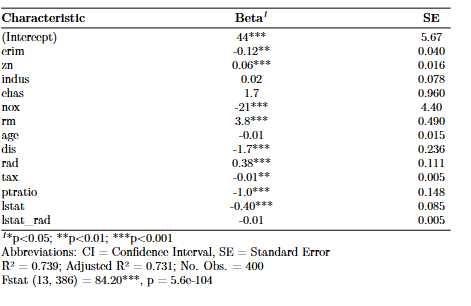

{width="600"}

```{r libs, eval=TRUE, echo=FALSE}
#| message: false
#| warning: false

# install.packages(c("modelsummary", "fixest"))

#install.packages("GGally")
#install.packages("gtsummary")
#install.packages('stargazer')
#install.packages('patchwork')
#install.packages("glmnet")
#install.packages('lmridge')
#install.packages('MASS')
#install.packages("interactions")
#tinytex::tlmgr_install("tabularray")
#install.packages("car")

library(dplyr)
library(knitr)
#library(skimr)
library(plotly)
library(ggplot2)
library(ggpubr)
library(lubridate)
library(zoo)
library(tidyverse)
library(GGally)
library(modelsummary)
library(stargazer)
library(gtsummary)
library(patchwork)
library(glmnet)
library(lmridge)
library(tidyr)
library(caret)
library(MASS)
library(dplyr)
library(interactions)
library(kableExtra)
library(patchwork) 
library(knitr)
library(broom)
library(car)
```

```{r, data_read,echo=FALSE,eval=TRUE}
boston_data_training=read.csv('my_boston.csv')
boston_data=read.csv("boston.csv")


```

# Introduction

This report explores and analyzes the key predictors of median house values in the Boston area using various linear regression techniques. The predictors range across multiple factors, including the average number of rooms per household (rm), the concentration of nitrous oxide pollutants in the area (nox), and the full value of property taxes (taxes). The regression results of these various models are compared against each other to gauge which models and predictors capture the variation of median house prices observed in the data. The key contention among the linear models is the balancing of out-of-sample accuracy as well as the inferential and interpretable soundness of the models.The presence of multicollinearity among predictor variables presents a key challenge to understanding the marginal contribution of the individual regressors to the response variable, medv. \
To address this, several variable selection approaches are compared to the baseline:  **Backward Stepwise Regression, Ridge regression, LASSO Regression**, and the inclusion of an **Interaction-Feature-Included** model. Model performance is evaluated using both mean squared error metrics, residual diagnostic checks, as well as the significance and magnitudes of the various predictors across the different models (and the stability thereof). Finally, important consideration is given to the trade-off between model complexity and interpretability, and the justification for which model performed best, given all the aforementioned information.

# Exploratory Data Analysis

For the sake of data and analysis completeness, EDA is conducted on the entire Boston dataset.

**Data Attributes**

```{r data_atrr, eval=F, echo=FALSE}
#| message: false
#| warning: false


kable(data.frame(row_count=nrow(boston_data) , column_count=ncol(boston_data)),
      caption = "boston data attributes")


```

```{r var_summary, eval=T, echo=F}
#| message: false
#| warning: false

col_types = sapply(boston_data, class)

col_types_df = data.frame(column = names(col_types), datatype = as.character(col_types))

#kable(col_types_df,caption = "boston data column data types")

col=c('column','na_count')
na_cnt=data.frame(colSums(is.na(boston_data))) %>%
  rownames_to_column("old_index") %>% 
  rename_with(~ col)


col_types=left_join(col_types_df,na_cnt,by='column') %>% rename(feature='column')

feat_mins=unname(sapply(boston_data,min))
feat_q1=sapply(boston_data, quantile, probs = 0.25, na.rm = TRUE)
feat_mean=sapply(boston_data, mean)
feat_median=sapply(boston_data, quantile, probs = 0.50, na.rm = TRUE)
feat_q75=sapply(boston_data, quantile, probs = 0.75, na.rm = TRUE)
feat_max=sapply(boston_data,max)
feat_var=sapply(boston_data,var)

variable_summ=data.frame(feature=names(boston_data), 
                         `min`=unname(sapply(boston_data,min)),
                         q25=unname(feat_q1),
                         `mean`=unname(feat_mean),
                         `meadian`=unname(feat_median),
                         q75=unname(feat_q75),
                          `max`=unname(feat_max),
                         `sd`=round(unname(feat_var),2)**0.5
                         
                         )

variable_summ=left_join(variable_summ,col_types,by='feature')


# kable(variable_summ, caption = 'Boston Data Data Summary', format = "latex", booktabs = TRUE) %>%
#   kable_styling(latex_options = c("hold_position")) %>%
#   landscape()
#   


```

{width="553"}

The complete data set contains 506 observations across 13 columns. The data is complete, with no null values, and all columns are registered as numeric. **Tax (28404), age (792), and zn (543)** display the greatest variance across the features, whilst **nox (0.01) and rm (0.49)** show the least variance across their respective values.

**Median House Value Distributions**

```{r target_val_dist, eval=TRUE, echo=FALSE}
#| message: false
#| warning: false

##| label: fig-medv_hist

fig1=boston_data %>% dplyr::select(all_of(names(boston_data))) %>% mutate(chas=factor(chas,levels=c(0,1))) %>% 
  ggplot(aes(x=medv) ) +
  geom_histogram(fill='steelblue') +
  labs(title = "Distribution of median house values",x='median house value ($000)')+
  theme_minimal()
```

```{r chas_dist, eval=TRUE, echo=FALSE}
#| message: false
#| warning: false

##| label: fig-chas_obs


fig2=boston_data %>% group_by(chas) %>% 
 summarize(row_cnt=length(medv)) %>% 
  mutate(chas=factor(chas,levels=c(0,1))) %>% 
    ggplot(aes(x=chas,y=row_cnt,group=1) ) +
  geom_col(fill = "steelblue") +
  labs(title = "Count of Observations by Chas Factor",x='chas',y='#observations')+
  theme_minimal()
```

```{r medv, eval=TRUE, echo=FALSE}
#| message: false
#| warning: false

fig3=boston_data %>%
  mutate(chas=factor(chas,levels=c(0,1))) %>% 
    ggplot(aes(x=chas,y=medv,fill = chas) ) +
  geom_boxplot() +
  labs(title = "Distribution of Median House Value Grouped By Chas",x='chas',y='median value ($000)')+
  theme_minimal()


```

The shape of the distribution of median house values is fairly bell-shaped, with 41% (208) of median house values falling between approximately \$18K and \$23K. While 93% (471) of observations belong to the category with `chas = 0`, the median house value for observations with `chas = 1` is 11% higher at \$23.3K compared to those in the `chas = 0` category. Additionally, observations in the `chas = 1` group show a skew towards higher values, unlike those in the `chas = 0` group, which exhibit a more balanced distribution around the median. Despite these differences in distribution, the two boxplots overlap, suggesting that the observed difference in means between the two groups may not be immediately statistically significant[^1].

[^1]: A difference-of-means hypothesis test would need to be conducted to formally assess whether the observed difference between group means is statistically significant.

```{r rad_index_dist, eval=TRUE, echo=FALSE}
#| message: false
#| warning: false


fig4=boston_data %>%
  mutate(rad=factor(rad,levels=(sort(unique(boston_data$rad)) ))) %>% 
  group_by(rad) %>% 
  summarize(row_cnt=length(medv)) %>% 
  ggplot(aes(x=rad,y=row_cnt) ) +
  geom_col(fill ='steelblue') +
  labs(title = "Distribution of Median House Value Grouped By Rad Index",x='rad index',y='#observations')+
  theme_minimal()


```

```{r patches1, eval=TRUE}
#| message: false
#| warning: false
#| fig-cap: "Median House Value Distribution,Grouped by Chas"
#| fig-height: 5.5
#| fig-width: 9


#wrap_plots(fig1,fig2 , ncol = 2)
##| label: fig-radial_index_obs

(fig1)/(fig3+fig2)


```

```{r,med_val_index,echo=FALSE,eval=TRUE}

fig5=boston_data %>%
  mutate(rad=factor(rad,levels=(sort(unique(boston_data$rad)) ))) %>% 
  ggplot(aes(x=rad,y=medv,fill = rad) ) +
  geom_boxplot() +
  labs(title = "Distribution of Median House Value Grouped By Rad Index",x='rad index',y='median value ($000)')+
  theme_minimal()
  

```

```{r patch_2, eval=TRUE, echo=FALSE}
#| message: false
#| warning: false
#| fig-height: 5.5
#| fig-width: 8
#| fig-cap: "Distribution of Median House Values by Radial Accesibility Index"

##| label: fig-radial_index_box_plot
fig4/fig5
```

Most observations fall within the RAD index values of 4, 5, and 24. When grouping house value distributions by RAD index value, there is no discernible trend in median house values with changes in the RAD index. However, observations with a RAD value of 24 show the lowest house values among the different index, with no overlap with the other box plots.

**Feature Correlations**

```{r,eval=TRUE, echo=FALSE}
#| label: fig-heatmap
#| fig-cap: "Feature Correlations"
#| fig-height: 4.5
#| fig-width: 10.5

library(reshape2)
corr_data=boston_data %>% mutate(chas=factor(chas)) %>% 
  dplyr::select(where(is.numeric)) %>% 
  cor(use = "pairwise.complete.obs")


corr_data_df=melt(corr_data)

hp=corr_data_df %>% ggplot(aes(x=Var2, y=Var1, fill=value))+
geom_tile() +
  scale_fill_gradient2(low = "blue", high = "red", mid = "white", 
                       midpoint = 0, limit = c(-1,1), space = "Lab", 
                       name="Pearson\nCorrelation") +
  geom_text(aes(label = round(value, 2)), color = "black")+
  labs(title = "Feature Correlation Matrix",x='Feature',y='Feature')+
  theme(axis.text.x = element_text(angle = 45, vjust = 0.5, hjust = 1))


```

{width="553" height="296"}

The data shows evidence of multicollinearity amongst regressors, with 8 out of 11 explanatory features reporting linear correlations \>=70%. In particular, features, **rm and tax** display the largest correlation (\~91%), in absolute value. Features, **lstat (\~-74%)** and **rm (\~70%),** show the highest absolute value correlations to the response value variable.

```{r, eval=TRUE, echo=FALSE}
#| message: false
#| warning: false
#| label: fig-pairplot
#| fig-cap: "Feature Pairplot"
#| fig-height: 10
#| fig-width: 15

# comeback and make this look better
# feat=c("crim",    "zn"      "indus"   "chas"    "nox"     "rm"      "age"     "dis"     "rad"     "tax"     "ptratio" "lstat"   "medv" )

boston_data %>% dplyr::select(all_of(names(boston_data))) %>% mutate(chas=factor(chas,levels=c(0,1))) %>% 
  ggpairs(setdiff(names(boston_data), "chas"),mapping = aes(color = chas), legend = 1 ) +
  labs(title = "Feature Pairwise Plot")+
  theme_minimal()+
  theme(legend.position = "bottom")
```

The correlations between the response variable, **medv**, and all other numeric features are significant at the 1% level. The observed relationship between medv and its highest correlated feature, **lstat** appears to be negatively non-linear upon visual inspection of the shape of the scatter plot.

Grouped by the **chas** feature, for cases where chas =1 (which have shown to have higher median house values) median house values correlations lose their statistical significance across 7 features, namely **crime, indus, age ,dis, rad, tax, and ptratio.\
**\
Another interesting feature interaction is that of the **nox** and the **dis** features, which show a significant negative correlation, with the shape of the scatter plot also indicating non-linearity. This is intuitively reasonable as the greater the distance to employment centers, the less traffic in the area, resulting in lower levels of pollutants (nox).

```{r,eval=F,echo=F}

log_v=boston_data %>% dplyr::select(all_of(names(boston_data))) %>% mutate(chas=factor(chas,levels=c(0,1))) %>% mutate(log_lstat=log(lstat)) %>% 
  ggplot(aes(x=log_lstat,y=medv,color=chas))+
  geom_point()+
  labs(title = "Transformed",x='log(lstate)',y='medv')+
  theme_minimal()
  

normal_l=boston_data %>% dplyr::select(all_of(names(boston_data))) %>% mutate(chas=factor(chas,levels=c(0,1))) %>% mutate(log_lstat=log(lstat)) %>% 
  ggplot(aes(x=lstat,y=medv,color=chas))+
  geom_point()+
  labs(title = "Normal",x='lstate',y='medv')+
  theme_minimal()
  

(log_v+normal_l)
```

# Model Building

**Baseline Model**

Method: Use all regressors in the model, with minimal transformation. The **chas** variable will be transformed into a factor as it is categorical whilst the rad (index) variable will be kept as a numeric variable to preserve its ordinality

```{r lm_fit, eval=TRUE, echo=FALSE}
#| message: false
#| warning: false
#| results: asis

# Scale the data before training
features=head(names(boston_data_training),-1)
boston_data_training=as.tibble(boston_data_training) 

# Scale the data- standardization
# Every feaure except the chas feature
scaled_trd=data.frame(scale(boston_data_training %>% dplyr::select(any_of(features[features!='chas']))))


tr_d=boston_data_training %>% 
    mutate(chas=factor(chas,levels=c(0,1))) 


all_feat_model=lm(medv ~ ., data=tr_d)

```

```{r,all_var_mod_summ,eval=T,echo=F}

#| tbl-pos: H
model_summary = summary(all_feat_model)

# extarct Fstat
f_value = model_summary$fstatistic[1]
f_df1   = model_summary$fstatistic[2]
f_df2  = model_summary$fstatistic[3]

# get associated pval
f_pvalue = pf(
  f_value,
  f_df1,
  f_df2,
  lower.tail = FALSE
)

f_text <- sprintf(
  "Fstat (%d, %d) = %.2f***, p = %.3g",
  f_df1, f_df2, f_value, f_pvalue
)


bl_summ=tbl_regression(all_feat_model,
                       intercept = TRUE) %>%
  add_significance_stars() %>%
  add_glance_source_note(
    include = c(r.squared, adj.r.squared, nobs)
  ) %>%
  modify_source_note(
    source_note = f_text
  ) %>%
  modify_caption("**Baseline Model:All Feature Regression Summary**")

```

{width="397"}

Model Performance:

-   The model shows a relatively good fit to the training data, with \~74% of the variation in the data, explained by the model

-   9 out of the 12 feature coefficients (excluding the intercept) are statistically different from 0 at at lest the 10% level, with 9 of these significant at the 1% level

-   Nitrogen Oxide concentration (nox) levels show the biggest marginal contributer, in absolute value, to median house values, medv, with an estimated negative change of -\$20.6K in estimated average house values per one unit increase in nox levels.

-   The F statistic is also significant at the 1% level, indicating that the coefficients of the model are jointly statistically different from 0.

**Prediction of test data set**

```{r,test_pred,eval=TRUE,echo=FALSE}


row_labels_training = rownames(boston_data_training)
row_labels_all=rownames(boston_data)

test_indicies=setdiff(row_labels_all,row_labels_training)
test_data=boston_data %>% slice(sapply(test_indicies,as.integer))
a=colnames(test_data)
features=a[1:length(a)-1]
new_data=test_data %>% dplyr::select(all_of(features)) %>% mutate(chas=factor(chas,levels=c(0,1)))

scaled_test_features=data.frame(scale(new_data %>% 
        dplyr::select(any_of(features[!features %in% c('chas','zn')])
               )) )
scaled_test_features$chas=new_data$chas
scaled_test_features$zn=new_data$zn
#scaled_test_features$medv=test_data$medv

      
test_predictions=predict(all_feat_model,newdata=new_data)

```

```{r,test_mse,eval=TRUE,echo=FALSE}


mse_func=function(ytrue,y_pred){
  errors=ytrue-y_pred
  mse=mean(errors**2)
  return(mse)
}

y_true=test_data$medv

mse_base=mse_func(y_true,test_predictions)

aic_base=AIC(all_feat_model,k=2) # use default value
bic_base=BIC(all_feat_model)


bl_mse=data.frame(`baseline mse`=round(mse_func(y_true,test_predictions),2))
kable(bl_mse,caption='Baseline Test MSE')

```

The out-of-sample (OOO) MSE for the baseline model is \$16.64K, that is, on average the baseline model's home values predictions are expected to deviate from their actual by this values (which is greater that the standard deviation of median house values of \~\$9.2K).

# Model Improvement

**Backwards Step wise Variable Selection**

Method:

1.  Start off with the baseline model: regress response variable against all features
2.  Iteratively remove one feature, retrain the model and store both the AIC and BIC scores for each retrained model- the StepAIC function terminates when subsequent feature removals does not improve AIC/BIC.

```{r bk_step, eval=TRUE, echo=FALSE}
#| message: false
#| warning: false
#| fig-height: 2
#| fig-width: 6
#| fig-cap: "AIC and BIC curves per Backwise Steo Regression Iteration"

##| label: fig-barplot
# Backwides Stepwise Regression
# incrementally decrease the number of features from the regression 
# For each removal, fit the model
# apply fit model on test data-subsetted for the selected features
# store the mse for each iteration

mses=c()
model_feat=c()
aics=c()
bics=c()

set.seed(718)


models = list()
mod0=lm(medv ~1 , data=tr_d) 
bk_model=stepAIC(all_feat_model,direction='backward',scope=formula(mod0), trace =0,keep=function(model, AIC) {
    models[[length(models) + 1]] <<- model # keep/store all intermediate models as well as their AIC scores
    return(AIC) }
    )

# Store into a dataframe

results <- data.frame(
  Step = seq_along(models),
  AIC = sapply(models, AIC),
  BIC = sapply(models, BIC),
  Variables = sapply(models, function(m) {
    paste(names(coef(m))[-1], collapse = ", ")
  })
)

p=results %>% mutate(Step=factor(Step,levels=c(1,2,3))) %>% 
  ggplot(aes(x = Step,group=1)) +
  geom_line(aes(y = AIC, color = "AIC")) +
  geom_point(aes(y = AIC, color = "AIC")) +
  geom_line(aes(y = BIC, color = "BIC")) +
  geom_point(aes(y = BIC, color = "BIC")) +
  scale_color_manual(
    name = "Metric",
    values = c("AIC" = "red", "BIC" = "blue")
  ) +
  labs(
    title = "AIC and BIC Scores per Backward Regression Iteration",
    x = "Iteration Step",
    y = "IC Score"
  ) +
  theme_minimal()

p

```

```{r bk_summ, eval=TRUE, echo=FALSE}
#| message: false
#| warning: false
#| tbl-pos: H


model_summary_bk = summary(bk_model)

# extarct Fstat
f_value_bk = model_summary_bk$fstatistic[1]
f_df1_bk   = model_summary_bk$fstatistic[2]
f_df2_bk  = model_summary_bk$fstatistic[3]

# get associated pval
f_pvalue_bk = pf(
  f_value_bk,
  f_df1_bk,
  f_df2_bk,
  lower.tail = FALSE
)

f_text_bk <- sprintf(
  "Fstat (%d, %d) = %.2f***, p = %.3g",
  f_df1_bk, f_df2_bk, f_value_bk, f_pvalue_bk
)


bk_summ_reg=tbl_regression(bk_model,
               intercept=TRUE) %>%
  add_significance_stars() %>%
  add_glance_source_note(
    include = c(r.squared, adj.r.squared, nobs)
  ) %>%
  modify_source_note(
    source_note = f_text_bk
  ) %>%
  modify_caption("**Backward Stepwise Best Model Regression Summary**")

```

{width="475"}

Backward Step Regression Results:

1.  The step model reached the lowest AIC (\~2408) and BIC(\~2456) after 3 iterations with 10 out of the 12 features retained (subsequent removals of features did no improve scores).

2.  Features **crime, zn, chas, nox, rm, dis, rad, tax, ptratio and lstat** are retained whilst the **age** and **indus** variables are removed**.** All of these are still statistically significant at least up to the 10% level.

3.  All regressors also maintain their sign with very little changes to their marginal effects with respect to the response variable (realtive to the baseline model).

4.  R square (\~74%) and the F statistic (significant at 1%) are still in the same range and region as the baseline model.

**Ridge and Lasso Regression**

Method: Use cross validation to find the optimal regularization parameter(s) ,$\lambda$, that produce the minimum CV MSE error during training and compare the coefficients produced by the model.

```{r,ridge_regr,eval=F,echo=FALSE}

regressors= boston_data_training %>% mutate(chas=factor(chas,levels=c(0,1)))%>% dplyr::select( all_of( c('medv',features)))
regressors_x=model.matrix(medv~.,data=regressors)[,-1]
y=boston_data_training$medv

# use lmridge , fit for a range of alphas
# from the lm ride documentation, the regressors are scaled, the "scale" option scales the data st it has mean=0 and var=1
# Using this method so we can track the aic
# Use various values of K/alpha and use AIC/BIC to choose the best penalty parameter 
ridge_model =lmridge(y~., data = boston_data_training, K = seq(0, 0.1, 0.01) , scaling = "scaled")


# get predictions
#ridge_pred=predict(ridge_model,newdata=test_data)

# get ridge metrics
#mse_ridge=mse_func(y_true,ridge_pred)
#mse_ridge

# get AIC
info_criteria=infocr(ridge_model)
info_criteria_df=as.data.frame(info_criteria)

info_criteria_df$K=seq(0, 0.1, 0.01) 

pivot_longer(info_criteria_df,
                    cols=c('AIC','BIC'),
                    names_to='IC Metric',
                    values_to='Score'
                    ) %>% 
  ggplot(aes(x=K,y=Score,color=`IC Metric`))+
  geom_line()+
  geom_point()+
  labs(title = "Ridge Regression Training AIC/BIC",x='alpha',y='Score')+
  theme_minimal()
  

```

```{r ridge_regr_coeff, eval=TRUE, echo=FALSE}
#| message: false
#| warning: false
#| fig-height: 3.5
#| fig-width: 6
#| fig-cap: "CV MSE vs Regularization Parameter"

##| label: fig-cvplot
x=data.matrix(boston_data_training[, features])
y=boston_data_training$medv
cv_model_ridge=cv.glmnet(x, y,alpha=0) # using kfolds, k=10, a=o for ridge refression


lambda_min <- -log(cv_model_ridge$lambda.min)
lambda_1se <- -log(cv_model_ridge$lambda.1se)

min_lam_index=which(cv_model_ridge$lambda==cv_model_ridge$lambda.min)
min_lam_cv_val=cv_model_ridge$cvm[min_lam_index]


se_lambda_index=which(cv_model_ridge$lambda==cv_model_ridge$lambda.1se)
se_lam_cv_val=cv_model_ridge$cvm[se_lambda_index]


#code below for creatinG CV error plot

#plot(cv_model_ridge) # CV MSE for different regularization values

#coef(cv_model_ridge, s = "lambda.1se")


# 
# plot(cv_model_ridge,
#      xlim = c(-9,1.8),
#      ylab='CV MSE'
# )


# text(lambda_min+0.08 , max(cv_model_ridge$cvm),
#      labels = paste("min:",round(cv_model_ridge$lambda.min,2)),
#      pos = 4, col = "red",
#      cex = 0.7)
# 
# text(lambda_1se-0.2, max(cv_model_ridge$cvm),
#      labels = paste("1se:",round(cv_model_ridge$lambda.1se,2)),
#      pos = 4, col = "blue",
#      cex = 0.7)
# 
# 
# title(main = "Ridge Regression Cross-Validation Error",line = 2.5)


```

```{r, ridge_regre_coeff, echo=FALSE, eval=TRUE}

min_lambda_coeff=as.data.frame( as.matrix(coef(cv_model_ridge, s = "lambda.min"))) %>% 
    rownames_to_column(var = "Feature")# coeff at lambd min

#as.data.frame(coef(cv_model_ridge, s = "lambda.1se")) # coeff at lambd 1se

lambda_1se_coeff=as.data.frame( as.matrix(coef(cv_model_ridge, s = "lambda.1se"))) %>% rownames_to_column(var = "Feature")


ridge_coeff = left_join(min_lambda_coeff, lambda_1se_coeff, by = "Feature") 
  


# train_pred_lambda_min=predict(cv_model_ridge,s = "lambda.min",newx=x)
# train_pred_lambda_1se=predict(cv_model_ridge,s = "lambda.1se",newx=x)
# 


```

```{r,lasso_regr,eval=TRUE,echo=FALSE}
x=data.matrix(boston_data_training[, features])
y=boston_data_training$medv
cv_model_lasso=cv.glmnet(x, y, alpha = 1) # using kfolds, k=10


lambda_min <- -log(cv_model_lasso$lambda.min)
lambda_1se <- -log(cv_model_lasso$lambda.1se)

min_lam_index=which(cv_model_lasso$lambda==cv_model_lasso$lambda.min)
min_lam_cv_val=cv_model_lasso$cvm[min_lam_index]

se_lambda_index=which(cv_model_lasso$lambda==cv_model_lasso$lambda.1se)
se_lam_cv_val=cv_model_lasso$cvm[se_lambda_index]

# Code below prodces the CV lambda plots 

# plot(cv_model_lasso,
#       xlim = c(-2,5),
#       ylab='CV MSE'
#  )
# 
# text(lambda_min+0.08 , max(cv_model_lasso$cvm),
#      labels = paste("min:",round(cv_model_lasso$lambda.min,2)),
#      pos = 4, col = "red",
#      cex = 0.7)
# 
# text(lambda_1se-0.35, max(cv_model_lasso$cvm),
#      labels = paste("1se:",round(cv_model_lasso$lambda.1se,2)),
#      pos = 4, col = "blue",
#      cex = 0.7)
# # 
# # 
# title(main = "Lasso Regression Cross-Validation Error",line = 2.5)

```

\begin{figure}[ht]
\centering
\begin{minipage}{0.48\textwidth}
\centering
\includegraphics[width=\linewidth]{CV_MSE_PLOT.png}
\end{minipage}
\hfill
\begin{minipage}{0.48\textwidth}
\centering
\includegraphics[width=\linewidth]{lasso_cv_mse.png}
\end{minipage}

\caption{Cross-validation mean squared error plots for Ridge and Lasso regression.}
\end{figure}

```{r,lass_coeff,echo=FALSE,eval=TRUE}

min_lambda_coeff=as.data.frame( as.matrix(coef(cv_model_lasso, s = "lambda.min"))) %>% 
    rownames_to_column(var = "Feature")# coeff at lambd min

lambda_1se_coeff=as.data.frame( as.matrix(coef(cv_model_lasso, s = "lambda.1se"))) %>% rownames_to_column(var = "Feature")


lass_coeff = left_join(min_lambda_coeff, lambda_1se_coeff, by = "Feature") 

```

```{r combined_coeff, eval=TRUE, echo=FALSE}
#| message: false
#| warning: false

combined_coeff = left_join(ridge_coeff, lass_coeff, by = "Feature") 
combined_coeff=combined_coeff %>% rename(ridge_lambda_min=lambda.min.x,
                          ridge_lambda_1se=lambda.1se.x,
                          lasso_lambda_min=lambda.min.y,
                          lasso_lambda_1se=lambda.1se.y)

knitr::kable(
  combined_coeff, 
  col.names = c(
    "Feature",
    "Ridge $\\lambda_{min}$",
    "Ridge $\\lambda_{1se}$",
    "LASSO $\\lambda_{min}$",
    "LASSO $\\lambda_{1se}$"
  ),
  escape = FALSE,
  caption = "Ridge and LASSO Regression Coefficients"
)

  
```

Regression Results:

1.  The best regularization parameters for the Ridge and LASSO models are reached at at $\lambda$ =0.69 (CV_MSE~min~ of \~25.48) and 0.03 ( CV_MSE~min~ \~27.9), respectively . The 1~se~ equivalent parameters for Ridge and LASSO are obtained at $\lambda$=4.86 (CV_MSE~min~ \~28.79) and $\lambda$=0.67 (CV_MSE~min~ \~27.99).
2.  For the simplest model, LASSO~1SE~ , 7 non-zero coefficients remained in the final model; the coefficients of **zn, indus, age,** and **rad** were all pushed to zero. In particular, **zn and rad** were statistically significant in the baseline model.
3.  The **nox** feature still maintains its position as the largest absolute marginal predictor of median house values across three out of the four models, with the **rm** feature having the largest marginal contribution to response variable in the LASSO 1~se~ model.
4.  In addition to a change in magnitude, some feature coefficients also show a change in sign in some of the models: the **indus** coefficient changes from positive to negative from the baseline in both the Ridge~1SE~ and Ridge~min~ models while the **rad** feature coefficient changes sign in the Ridge~1SE~ model (although this feature coefficient is highly penalized relative to the baseline).

**Predictions On Test Data**

For both the Ridge and LASSO regressions, the 1SE models will be used to favour model simplicity and further reduce the risk of over fitting; these are used to predict on the test data.

```{r pred_mse, eval=TRUE, echo=F}
#| message: true
#| warning: true

test_data_feat=test_data %>% mutate(chas=factor(chas,levels=c(0,1)))%>% 
  dplyr::select(all_of(features))

test_data_feat_x=data.matrix(test_data[, features])
y_test_true=as.vector(test_data %>% dplyr::select(medv) %>% pull())


bk_test_predictions=predict(bk_model,newdata=test_data_feat)
bk_test_predictions=as.vector(bk_test_predictions)
lasso_test_predictions=as.vector(unname(predict(cv_model_lasso, s='lambda.1se',newx=test_data_feat_x)))
ridge_test_predictions=as.vector(unname(predict(cv_model_ridge, s='lambda.1se',newx=test_data_feat_x)))

all_test_predictions=data.frame(backward_selection=bk_test_predictions,
                           ridge_predictions=ridge_test_predictions,
                           lasso_predictions=lasso_test_predictions,
                           y_true=y_test_true,
                           pred_id=1:106
                           )

test_mses=c(mse_base)


for(pred in head(names(all_test_predictions),-1) ){
  model_pred=all_test_predictions %>% dplyr::select(any_of(pred)) %>% pull()
  test_mse_i=mse_func(y_test_true,model_pred)
  test_mses=c(test_mses,test_mse_i)
  
}

  
test_mses_df=data.frame(metric=c('MSE'),
                        all_features=round(test_mses[1],2),
                        backwise_step=round(test_mses[2],2),
                        ridge=round(test_mses[3],2),
                        lasso=round(test_mses[4],2),
                        `average across models`=round(mean(test_mses[-length(test_mses)]),2)
                        )

rownames(test_mses_df) <- test_mses_df$MSE

kable(test_mses_df,caption = 'Test Data MSE Model Metrics')

```

Although the test scores MSE are relatively close to each other for 3 out of the 4 models, the variable selection models fail to outperform the baseline model, with the Backward Stepwise model coming in close second. The LASSO model has the worst test MSE out of the 4 at \$19.77K-11% higher than the average across models.

```{r pred_plots, eval=T, echo=FALSE}
#| message: false
#| warning: false
#| fig-height: 5
#| fig-width: 8
#| fig-cap: "Predictions Vs Actual Values"

##| label: fig-predlinplot

all_test_predictions %>% 
  ggplot(aes(x = pred_id)) + 
  geom_line(aes(y = y_true, color = "ytrue")) +
  geom_line(aes(y = backward_selection, color = "Backward Selection y_hat")) +
  geom_line(aes(y = ridge_predictions, color = "Ridge y_hat")) +
  geom_line(aes(y = lasso_predictions, color = "Lasso y_hat")) +
  labs(
    title = "Test Data Prediction Comparison",
    x = "observation index",
    y = "y",
    color = NULL   
  ) +
  theme_minimal()


```

All the model predictions show relatively good fit to the general shape and trend of the response variable in the test data, although there is general under prediction at some extreme points of the response data.

**Inclusion of Interaction Term**

Method: The **chas** and **rad**[^2] categorical variable provides an easy way of segmenting the data into distinct groups for which interactions with other variables can be created and analyzed. Thus the following process is used to choose the interaction feature:

[^2]: Measured as an index as per meta data definition

1.  Create interaction terms for all features with the chas feature: ${ChasIntVar}=\text{Feature}_i \times \text{chas}$

2.  Do the same for the rad feature: ${RadIntVar}=\text{Feature}_i \times \text{rad}$

3.  Analyze the correlations of all these interaction variables with respect to the response variable, and choose the interaction with the highest, and most statistically significant correlation.

4.  Add this term to the best-performing model, which in this case was the **full variable regression.**

5.  Again, for the sake of data completeness, the interaction correlation analysis is done on the full data set before the addition to the model.

```{r int_corrs_chas,echo=FALSE,eval=TRUE}
#| message: false
#| warning: false
#| fig-height: 12
#| fig-width: 14
#| fig-cap: "Interaction Features Pairplot-chas feature"

boston_data_chas=boston_data
int_feats=c('medv')
for(i in features){
boston_data_chas=boston_data_chas %>% mutate(!!paste0(i, "_chas") := .data[[i]] * chas)

int_feats=c(int_feats,paste0(i, "_chas"))
 
}

# Look at which interactions have strongest correlation with medv

corr_data=boston_data_chas %>% mutate(chas=factor(chas)) %>% 
  dplyr::select(any_of(int_feats)) %>% 
  cor(use = "pairwise.complete.obs")


boston_data_chas %>% dplyr::select(any_of(int_feats[int_feats!='chas_chas'])) %>% 
  ggpairs(columns=1:length(int_feats[int_feats!='chas_chas'])) +
  labs(title = "Interaction Features Pairwise Plot:Chas") +
  theme_minimal()


```

```{r int_corrs_rad,echo=FALSE,eval=TRUE}
#| message: false
#| warning: false
#| fig-height: 10
#| fig-width: 14
#| fig-cap: "Interaction Features Pairplot- rad feature"

boston_data_rad=boston_data
int_feats=c('medv')
for(i in features){
boston_data_rad=boston_data_rad %>% 
  mutate(!!paste0(i, "_rad") := .data[[i]] * rad)

int_feats=c(int_feats,paste0(i, "_rad"))
 
}

# Look at which interactions have strongest correlation with medv

corr_data=boston_data_rad %>% mutate(chas=factor(chas)) %>% mutate(rad=factor(rad, levels=( sort(unique(boston_data$rad))  ))) %>% 
  dplyr::select(any_of(int_feats)) %>% 
  cor(use = "pairwise.complete.obs")


boston_data_rad %>% dplyr::select(any_of(  int_feats[int_feats!='rad_rad']  )) %>% 
  ggpairs(columns=1:length(int_feats[int_feats!='rad_rad'])) +
  labs(title = "Interaction Features Pairwise Plot: Rad")+
  theme_minimal()

```

Across both pair plots, the **lstat_rad** interaction feature show the highest (in absolute value) and most statistically significant correlation (at 1%) among interacted features. This will be added to the training data for the best performing model.

```{r,int_regress,eval=T,echo=F}
#| tbl-pos: H

# best performing regression =all_feat regression

int_training_data= boston_data_training %>% mutate(lstat_rad=lstat*rad)
int_features=features
int_features[length(int_features)+1]='lstat_rad'
int_tr_d=int_training_data %>% dplyr::select( any_of(c(int_features,'medv')))

all_feat_with_int_model=lm(medv ~ ., data=int_tr_d)

model_summary_int = summary(all_feat_with_int_model)

# extarct Fstat
f_value_int = model_summary_int$fstatistic[1]
f_df1_int  = model_summary_int$fstatistic[2]
f_df2_int  = model_summary_int$fstatistic[3]

# get associated pval
f_pvalue_int = pf(
  f_value_int,
  f_df1_int,
  f_df2_int,
  lower.tail = FALSE
)

f_text_int <- sprintf(
  "Fstat (%d, %d) = %.2f***, p = %.3g",
  f_df1_int, f_df2_int, f_value_int, f_pvalue_int
)


int_regr=tbl_regression(all_feat_with_int_model,
               intercept=TRUE) %>%
  add_significance_stars() %>%
  add_glance_source_note(
    include = c(r.squared, adj.r.squared, nobs)
  ) %>%
  modify_source_note(
    source_note =f_text_int
  ) %>%
  modify_caption("**Interaction-Included Model Regression Summary**")
```



Despite the significance of the two individual features, **lstat and rad**, the engineered interaction feature did not prove to be a statistically significant predictor of median house values.

```{r,int_mse,echo=F,eval=T}
int_test_data=test_data
int_test_data$lstat_rad=int_test_data$lstat*int_test_data$rad
int_test_d=int_test_data %>% dplyr::select(any_of(c(features,'lstat_rad')))

int_test_pred=predict(all_feat_with_int_model,newdata=int_test_d)
```

```{r,int_mse_2, echo=FALSE,eval=T}

int_mse=mse_func(int_test_data$medv,int_test_pred)	# oos mse improves, although the addition of the int variable is not significant?

mse_comp=data.frame(Metric=c('MSE'), Baseline=c(mse_base), Interaction=c(int_mse))

kable(mse_comp,caption = 'Test Data MSE Comaparison: Baseline vs Interaction -Included Model')

```

Again, the inclusion of the interaction did not improve model performance, although the model mse deterioration was marginal compared to the test MSEs of LASSO and Ridge regressions.

# Residual Diagnostics

Residual analysis is conducted on the "best" performing model; the all-feature model.

```{r train_errors_hist, eval=T, echo=F}
#| message: false
#| warning: false
#| fig-subcap: ["Train Residuals", "Test Residuals"]
#| fig-height: 4
#| fig-width: 5
#| layout-ncol: 2


errors=resid(all_feat_model)
test_err=test_data$medv-test_predictions
hist(errors,main='Distribution of Train Errors')
hist(test_err,main='Distribution of Test Errors')

```

```{r,errors_qq,echo=F,eval=T}
#| message: false
#| warning: false
#| fig-subcap: ["QQ Plot To Check for Normality", "Residual Variance Plot to check Homoscedascity"]
#| fig-height: 4
#| fig-width: 5
#| layout-ncol: 2

plot(all_feat_model, which = 2)
plot(all_feat_model, which = 3)

```

Despite being the best performing model, residual analysis of the baseline model does not indicate that the errors follow the assumptions of the linear model, namely:

1.  Normality: Although the histograms for both the train and test residuals may indicate normality, the standardized residual points on the QQ plot do not fall on the straight line when compared to the theoretical normal distribution quantiles, suggesting non-normality. This greatly affects the ability and validity of statistical inference, especially concerning hypothesis testing on the key regression statistics, including prediction confidence intervals of the response variable (although the estimated coefficients are mostly unaffected).

2.  Homoscedasticity: The scale-location plot does not indicate that the variance of the residuals is constant[^3], rather it seems to follow an increasing trend when plotted against fitted values. This also greatly inhibit the ability to make valid statistical inferences, especially regarding the variance and precision of the regressors as well as the overall validity (significance) of the model.

[^3]: Homoscedasticity requires the plotted points to be scattered randomly about the line, with no discernible pattern.

# Conclusion: Considerations and Implications of the "Best" Model

Model accuracy and inference play a significant role in selecting the appropriate model for a specific task, and no single metric wholly captures the overall performance of a model. Although the baseline model reported the best out-of-sample performance based on the test Mean Squared Error (MSE), its observed model diagnostics were inadequate; challenging efficacy and consistency of the model if inference is the ultimate objective.

Multicollinearity is a key attribute of the data(which the baseline model cannot address without significant modification to the features) that significantly impacts the ability to disentangle the marginal influence of individual predictors on the response variable[@boriharn2023multicollinearity]. Ridge regression effectively penalizes the coefficients of highly correlated predictors (tax and rad) with a negligible impact on out-of-sample accuracy.\
\
Additionally, increasing model complexity through the addition of the interaction term did not improve accuracy; the term itself proved to be a statistically insignificant predictor of house values. Across the models, **pollutant levels (nox)** and the **average number of rooms per dwelling (rm)** emerged as the most significant marginal predictors of house values, consistently maintaining their rank and sign.

Given these considerations, the Ridge regression model is the most appropriate choice, as it strikes a favorable balance between maintaining model accuracy, simplicity, and interpretability.

# Appendix {.appendix}

```{r,vif,echo=FALSE,eval=T}

#| tbl-cap: Feature VIF

vif_values <- vif(all_feat_model)
vif_tab=data.frame(as.matrix(vif_values)) %>% rename(VIF=as.matrix.vif_values.)

kable(vif_tab,caption='Baseline Model: Feature Variance Inflation Factor')
```

All features moderate to high variance inflation factors, further supporting evidence of multicollinearity among features, with the biggest contributers are being the tax and rad features.
